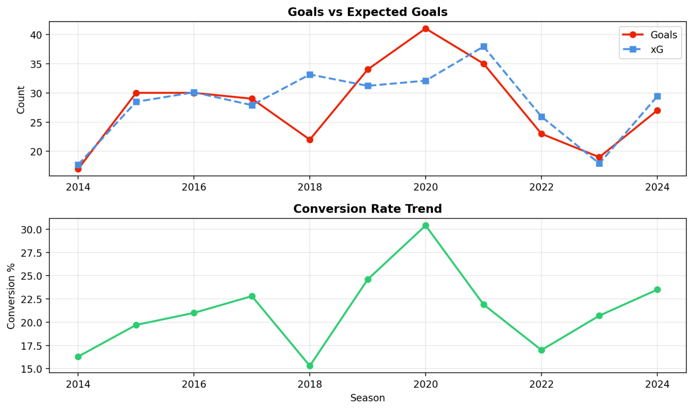

# ⚽ State of Play

A Streamlit application for analyzing football player shooting and finishing performance across different game states using Understat data.

## 📊 Overview

State of Play provides shot analysis for football players, focusing on performance across different game states. The app visualizes shooting patterns, expected goals (xG), and finishing efficiency through interactive dashboards and shot maps.

**🚀 [Live Demo](https://shivamsingh.streamlit.app/)**

---

## Features

- **Performance Dashboard**: Track conversion rates, xG efficiency, and shot consistency
- **Game State Analysis**: Compare player performance when winning, losing, or drawing
- **Shot Zone Mapping**: Analyze shooting patterns across different pitch zones
- **Seasonal Trends**: View performance changes across multiple seasons
- **Situation Breakdown**: Compare shots from open play, set pieces, penalties, and counters
- **Interactive Shot Maps**: Visual representation of all shots with customizable colors and themes

### Game State Definitions

- **Winning/Losing**: Team is ahead or behind (unspecified margin)
- **Winning/Losing by 1**: Exactly one-goal difference
- **Winning/Losing by More Than 1**: Two or more goals ahead/behind

### Advanced Analytics

- **Performance Dashboard**: Overall shooting statistics and efficiency metrics
- **Shot Zone Analysis**: Performance breakdown by location on the pitch
- **Seasonal Trends**: Year-over-year performance comparison with interactive charts
- **Situation Breakdown**: Shot distribution and success rates by play type

### Metrics Explained

- **xG (Expected Goals)**: Statistical measure of shot quality based on historical data
- **xG Overperformance**: Goals scored minus expected goals (positive = outperforming)
- **Conversion Rate**: Percentage of shots that result in goals
- **xG Efficiency**: Ratio of actual goals to expected goals
- **Shot Consistency**: Measure of shot quality variance (1 = perfectly consistent)
- **Game-State Altering Goal**: Goal that changes the match state (e.g., equalizer, go-ahead goal)

---

## 📊 Data

The application uses shot-level data from [Understat](https://understat.com), covering:
- **Leagues**: Premier League, La Liga, Bundesliga, Serie A, Ligue 1
- **Seasons**: 2014/15 to 2024/25
- **Metrics**: Shot location (x, y), xG value, outcome, shot type, situation

---

## 📝 License

This project is licensed under the MIT License - see the [LICENSE](LICENSE) file for details.

---

## 📸 Screenshots

### 🎯 Shot Map – Point Visualization (Dark Theme)
### 📅 Advanced Analytics – Seasonal Performance Trends

### ⚽ Advanced Analytics – Shot Situation Breakdown

### 🎯 Shot Map – Robert Lewandowski (Dark Theme)

---

